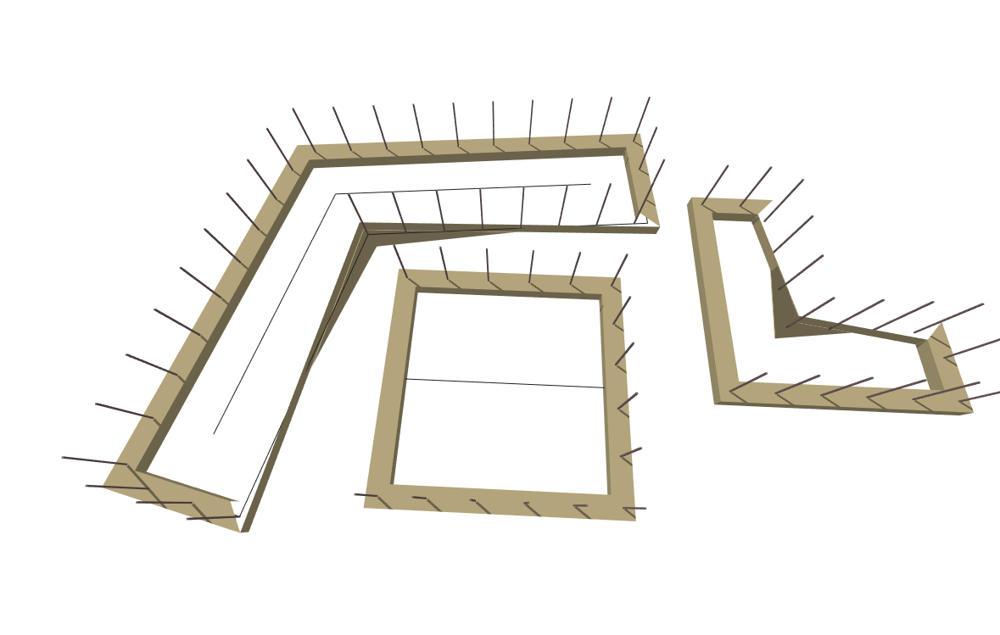

# testfunction1

The Testfunction1 function.

|Input Name|Type|Description|
|---|---|---|
|Offset Width|Range|The Offset Distance.|
|Bridge Width|Range|The width of the Bridge.|
|Bridge Height|Range|The height of the Bridge.|
|Material|Choice|the bridge's material.|
|Center Line|Geometry|The Center Line of the Bridge|

 

|Output Name|Type|Description|
|---|---|---|
|Volume|Number|The volume.|

